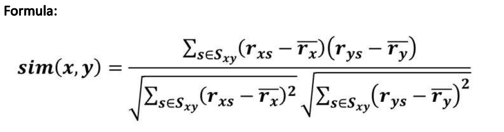
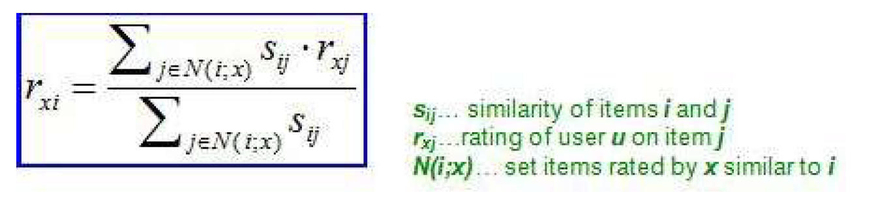
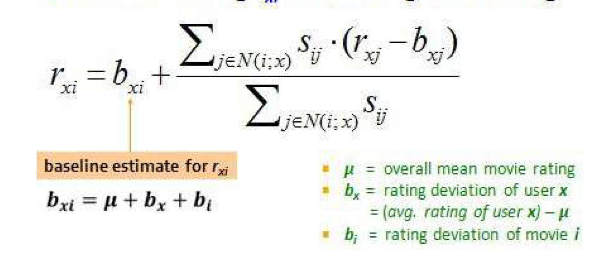
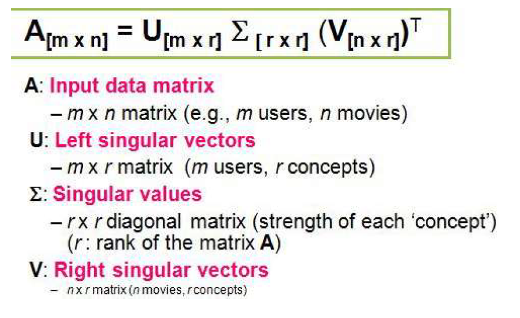
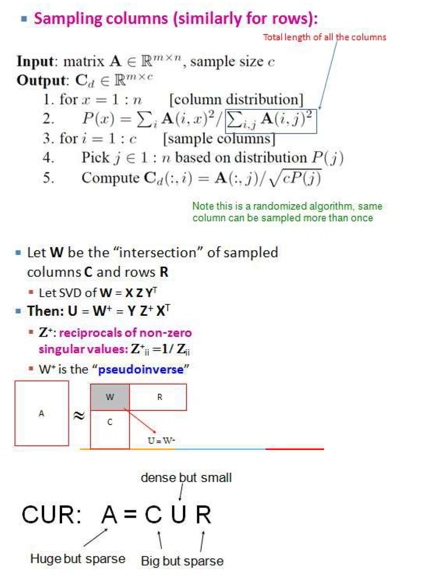
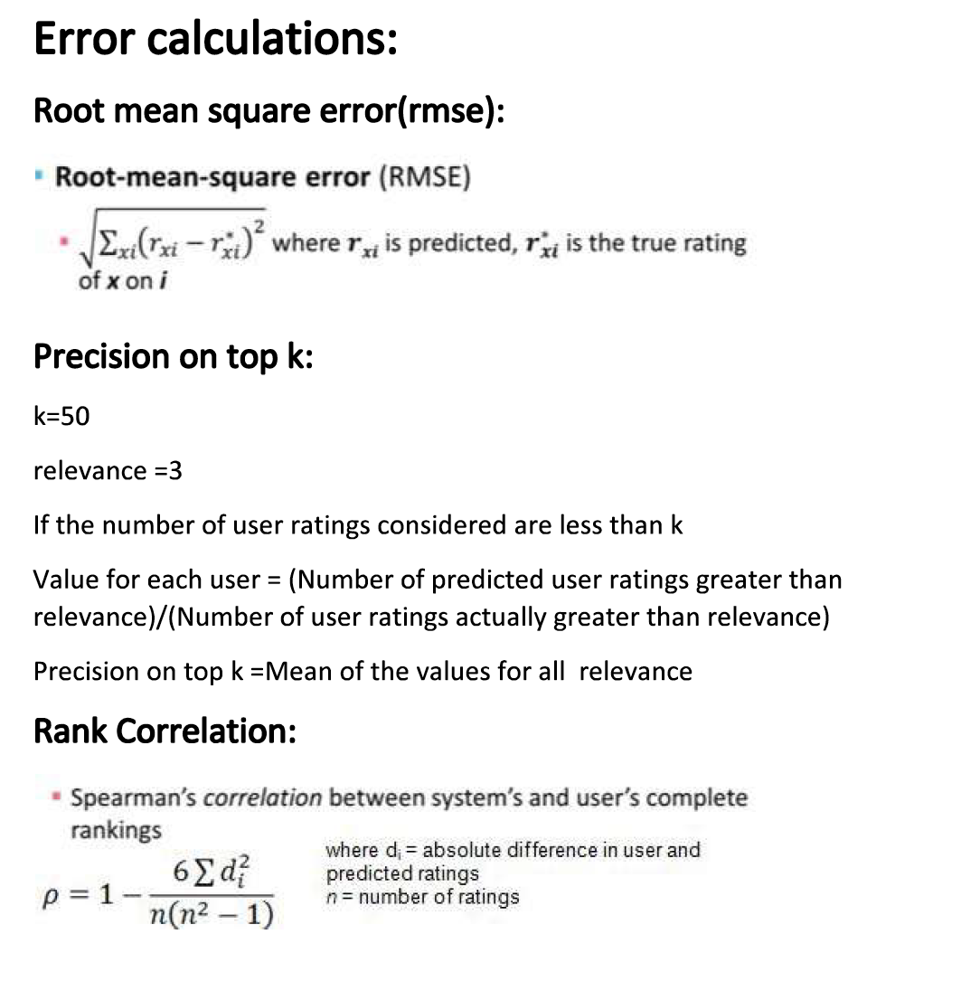

# Recommender-System
Implementation of various recommendation algorithms such as Collaborative filtering, SVD and CUR-decomposition to predict user movie ratings

## Requirements
* python
* numpy
* pandas
* scipy

## Run

The dataset used for training MovieLens data sets were collected by the GroupLens Research Project. This data set consists of 100,000 ratings ranging between 1 to 5 from 943 users on 1682 movies. You can download it from [Movielens 100K link](https://grouplens.org/datasets/movielens/100k/).

To run, execute following commands
```
python3 recommender.py
```

### Output
```
CollaborativeFiltering RMSE 0.8452675603293487
CollaborativeFiltering Spearmans Rank Correlation 0.9999999240526046
CollaborativeFiltering Precision On TopK 0.9024871794603606

CollaborativeFilteringBaseline RMSE 0.7675328677210587
CollaborativeFilteringBaseline Spearmans Rank Correlation 0.9999999373792241
CollaborativeFilteringBaseline Precision On TopK 0.8839798773318012

SingularValueDecomposition RMSE 3.780525477770839e-13
SingularValueDecomposition Spearmans Rank Correlation 1.0
SingularValueDecomposition Precision On TopK 1.0

CUR RMSE 1.7448751755958805
CUR Spearmans Rank Correlation 0.999999676366695
CUR Precision On TopK 1.0
```

## Various recommendation techniques formulae

### Collaborative Filtering



### Collaborative Filtering using Baseline Estimate


### Singular Value Decomposition


### CUR Decomposition


### Error Calculations


## License
Distributed under the Apache-2.0 License. See `LICENSE.txt` for more information.